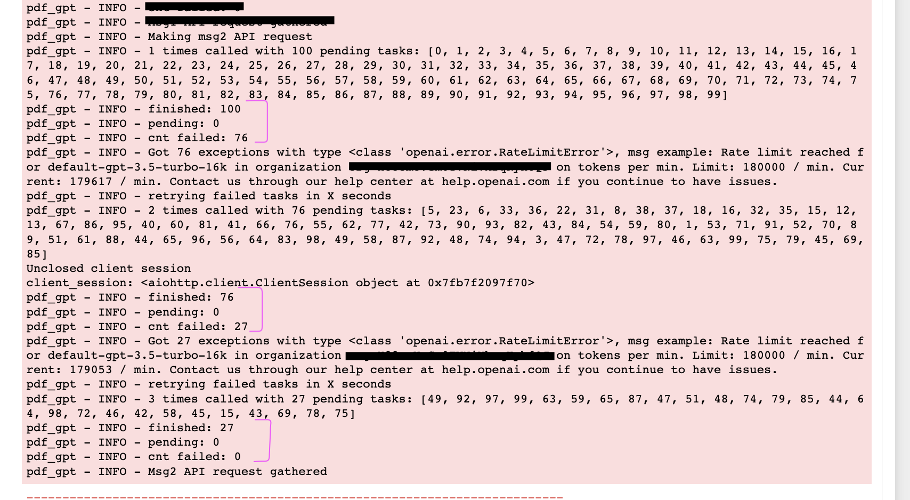

## Description
batch async requests to chatgpt with rerun on exception


## Prerequisites
You will need OpenAI account to run this code.
```python
os.environ["OPENAI_API_KEY"] = 'XXXXXXXX'
os.environ["OPENAI_API_BASE"] = "https://api.openai.com/v1"
```


## How to run
Check example in `run.py`:
```bash
python run.py
```

For running in Jupyter use following snippet:
```python
chats = [messages1, messages2, messages3]
resp = await async_completion.multiple_completions(chats)
print(resp)
```

## How retry works
All messages/tasks are send as API requests. Tasks that were rejected by sever will be retried in 30 seconds. This process will continue until all tasks will be completed without exceptions.



